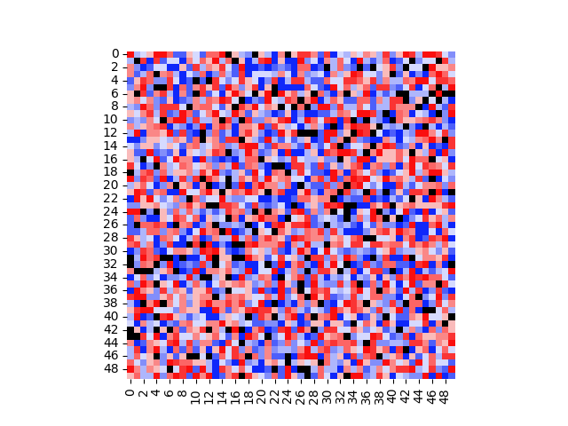
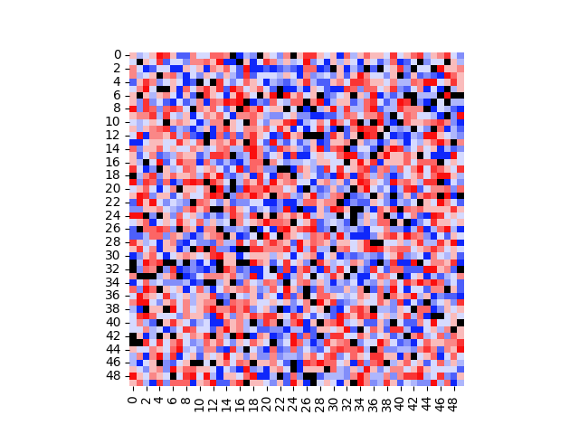
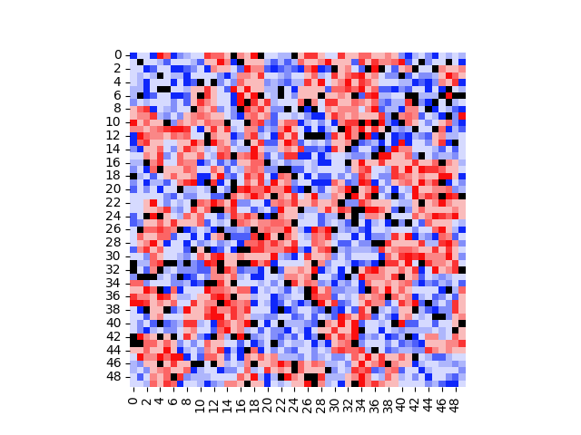

# Strategic Voting Model

This model is an agent-based model that is built on cellular automation. The aim is to study the evolution of strategic voting, but
the model can actually be thought of a more abstract framework for studying opinion formation in general. To demonstrate with an
example, see the following 50 frame GIF:

The initial and final states of the evolution are as follows:

